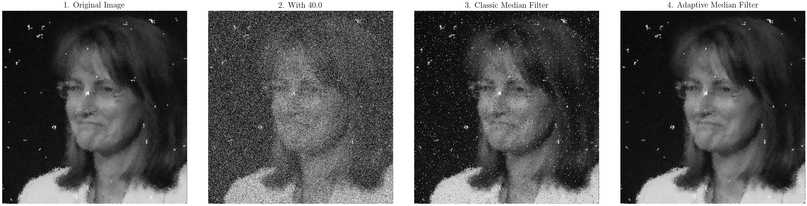
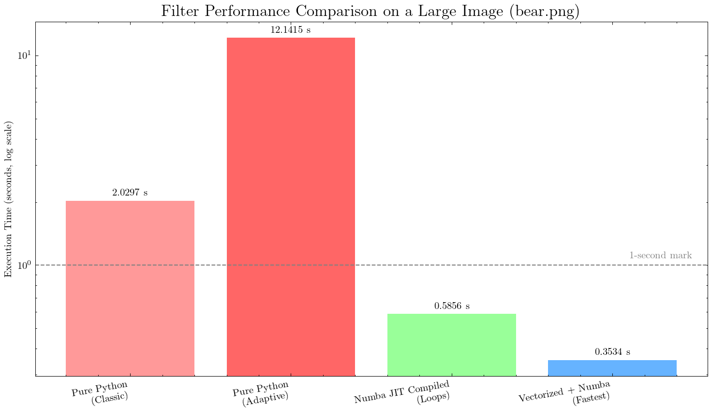

# An Advanced Adaptive Median Filter for Image Noise Reduction

This project provides a comprehensive implementation, analysis, and optimization of an Adaptive Median Filter designed to remove high-density salt-and-pepper noise from grayscale images. It compares the adaptive filter against a classic median filter, demonstrates a massive **>30x performance optimization** using Python, NumPy, and Numba, and introduces a novel mathematical analysis to determine the filter's "breaking point."

The project culminates in an interactive Streamlit dashboard for real-time visualization and exploration of the filter's behavior.

## Key Features

-   **Implementations**: Includes clear, from-scratch implementations of both the Classic and Adaptive Median Filters.
-   **Performance Optimization**: Showcases a step-by-step optimization process, moving from slow pure Python to a highly efficient, JIT-compiled version using Numba.
-   **In-Depth Analysis**: Introduces a method to analyze a filter's effectiveness by examining the proportional growth rate of error ($d'/d$), identifying a "breaking point" where performance catastrophically degrades.
-   **Interactive Dashboard**: An `app.py` built with Streamlit allows users to apply filters, adjust parameters, and explore the step-by-step filtering process on individual pixels.
-   **Benchmarking Suite**: A full test harness (`speed_comparison.py`) measures execution time, memory usage, and CPU hotspots for all filter implementations.

## The Problem: Salt-and-Pepper Noise

Salt-and-pepper noise introduces random black (0) and white (255) pixels into an image, severely corrupting its details. While a classic median filter can handle low levels of this noise, it struggles with high densities and often blurs important image features.


*From left to right: The original image, the image with 40% noise, the output of a classic 3x3 median filter, and the superior output of the adaptive median filter.*

## Core Concepts: The Adaptive Median Filter

The classic median filter's main flaw is its fixed window size. It treats all pixels equally, which leads to blurring of edges and loss of fine detail. The adaptive median filter intelligently varies its window size to distinguish noise from actual image features.

The algorithm operates in two stages at each pixel $(x, y)$:

-   **Stage A: Is the median value $Z_{med}$ itself noise?**
    -   It computes the minimum ($Z_{min}$), maximum ($Z_{max}$), and median ($Z_{med}$) intensity values within the current window $S_{xy}$.
    -   If the condition $Z_{min} < Z_{med} < Z_{max}$ is true, it means $Z_{med}$ is a representative intensity value and not an outlier. The algorithm proceeds to Stage B.
    -   If this condition is false, $Z_{med}$ is likely salt or pepper noise. The filter increases its window size and repeats Stage A.

-   **Stage B: Is the center pixel $Z_{xy}$ noise?**
    -   If the condition $Z_{min} < Z_{xy} < Z_{max}$ is true, the center pixel $Z_{xy}$ is not noise. The algorithm preserves this original value, **preventing image blurring**.
    -   If this condition is false, $Z_{xy}$ is identified as noise, and it is replaced by the non-noise median $Z_{med}$.

This adaptive process allows the filter to apply strong filtering only where needed, preserving details in other areas.

## Implementation & Performance Optimization

A naive Python implementation of this algorithm is extremely slow due to nested loops. This project demonstrates a powerful optimization pipeline.


*(Note the logarithmic scale, highlighting orders-of-magnitude improvement)*

1.  **Pure Python Baseline**: The initial implementations use Python loops to iterate over each pixel. While easy to understand, they are computationally expensive. The pure Python adaptive filter is the slowest of all, taking over 12 seconds for a single large image.

2.  **JIT Compilation with Numba**: By adding a simple `@njit` decorator from the Numba library, the Python loops are Just-in-Time (JIT) compiled into highly efficient machine code. This single step eliminates the Python interpreter overhead and provides a **~20x speedup**, bringing the execution time down from 12.14s to 0.58s.

3.  **Vectorization + Numba (Fastest)**: The pinnacle of performance is achieved by first rewriting the algorithm's logic to use NumPy's vectorized operations (operating on arrays instead of individual elements) and then compiling this new version with Numba. Numba can optimize and fuse these high-level NumPy calls, resulting in an additional **~2x speedup**. The final version runs in just **0.35s**, a total **34x improvement** over the original.

## Deep Dive: Analytical Insights & The "Breaking Point"

Beyond just implementing the filter, this project analyzes *when* a filter is effective. The error, or normalized difference $d$, between a filtered image $I_{filt}$ and the original image $I_{orig}$ is defined as:

$$
d = \frac{1}{255} \sqrt{\frac{1}{N} \sum_{x,y} (I_{filt}(x,y) - I_{orig}(x,y))^2}
$$

By plotting the **proportional growth rate of error ($\frac{d'}{d}$)** against the noise probability $p$, we can identify the filter's "breaking point."


-   **Top Plot (Observation)**: The normalized error ($d$) increases at an accelerating rate as noise is added.
-   **Bottom Plot (Insight)**: The proportional growth of error ($\frac{d'}{d}$) reveals a distinct peak. This peak is the **breaking point**, where the filter's performance degrades most violently. This allows us to define three operational zones:
    -   **Safe Zone ($p < 0.23$)**: The filter is highly effective.
    -   **Critical Zone ($p \approx 0.23$)**: The filter begins to fail catastrophically.
    -   **Failure Zone ($p > 0.23$)**: The filter is overwhelmed and may do more harm than good.

This analysis provides a data-driven threshold for deciding whether applying the filter is advisable.

## Results: Visual Gallery

The superiority of the adaptive filter, especially at high noise densities, is evident across a wide range of images.

**Gallery for model.png (Lena)**


<details>
<summary><b>Click to view: Gallery for dog.png</b></summary>


</details>

<details>
<summary><b>Click to view: Gallery for bear.png</b></summary>


</details>

<details>
<summary><b>Click to view: Gallery for flask.png</b></summary>


</details>

## Interactive Dashboard

To explore these concepts interactively, run the Streamlit application:

```bash
streamlit run app.py
```

The dashboard allows you to:
-   Upload your own images.
-   Adjust noise levels in real-time.
-   Change filter parameters for both classic and adaptive filters.
-   Select a pixel and see a step-by-step visualization of the algorithm's decision-making process.

## How to Run the Project

1.  **Clone the repository:**
    ```bash
    git clone <your-repo-url>
    cd <your-repo-name>/code
    ```

2.  **Create a virtual environment and activate it:**
    ```bash
    python -m venv .venv
    source .venv/bin/activate
    ```

3.  **Install the required dependencies:**
    *(You should create a `requirements.txt` file with `numpy`, `matplotlib`, `numba`, `memory-profiler`, `streamlit`, and `Pillow`)*
    ```bash
    pip install -r requirements.txt
    ```

4.  **Run the analysis and benchmarking scripts (optional):**
    ```bash
    # To run the performance comparison
    python speed_comparison.py

    # To generate all the documentation images
    python docs_material.py
    python docs_material_extended.py
    ```

## Limitations & Future Work

-   **Grayscale Only**: The current implementation is optimized for 2D grayscale images.
-   **Static Breaking Point**: The $\frac{d'}{d}$ analysis was performed for a fixed 3x3 classic filter. This breaking point would shift for different filter sizes or types.
-   **Noise Type**: The filters are specifically designed for salt-and-pepper noise and are not effective against other types like Gaussian noise.

**Future enhancements could include:**
-   Support for 3-channel (RGB) color images.
-   Implementation of other advanced noise reduction filters for comparison.
-   GPU acceleration using CuPy or Numba's CUDA capabilities for even faster processing.

## Project Structure

```
.
├── code
│   ├── adaptive_median_filter.py         # Pure Python adaptive filter
│   ├── adaptive_median_filter_p.py         # Numba JIT compiled version
│   ├── adaptive_median_filter_p_compiled.py # Vectorized + Numba version (fastest)
│   ├── app.py                            # Streamlit interactive dashboard
│   ├── docs/                             # Generated images for documentation
│   ├── docs_material.py                  # Script to generate primary plots
│   ├── docs_material_extended.py         # Script to generate image galleries
│   ├── image_io.py                       # Image loading/saving utilities
│   ├── images/                           # Sample images for testing
│   ├── median_filter.py                  # Pure Python classic filter
│   ├── noise_generator.py                # Salt-and-pepper noise utility
│   └── speed_comparison.py               # Performance benchmarking script
└── README.md
```


- Sources :

[https://en.wikipedia.org/wiki/Noise_reduction]

[https://en.wikipedia.org/wiki/Median_filter]

[https://www.irjet.net/archives/V6/i10/IRJET-V6I10148.pdf]
